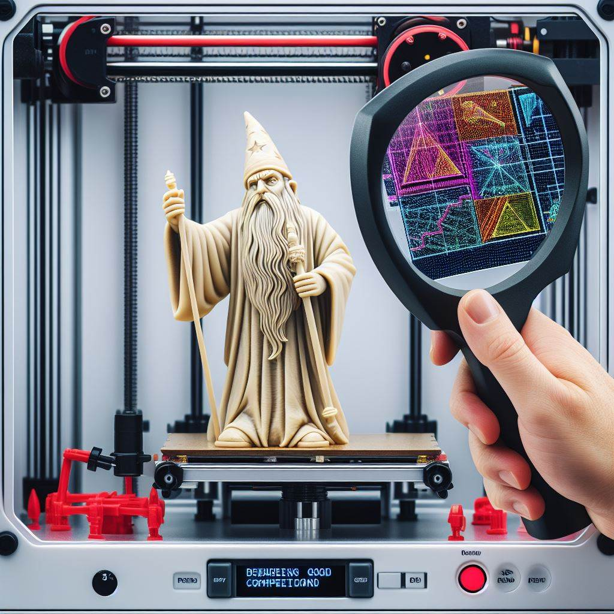

# What a Print!

## Author
Felipe Camargo de Pauli  
fcdpauli@gmail.com

## Description
A system to analyse the problems of a part printed in a 3D Printer.

## Todo:
### Target 1. The first match!
A system that returns the problem of a part using its image.

> Functional requirements:

> Technical requirements:

### Target 2.  
Soon...

### Target 3. 
Soon...